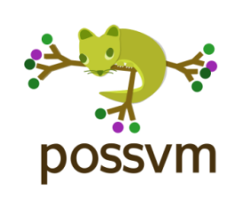
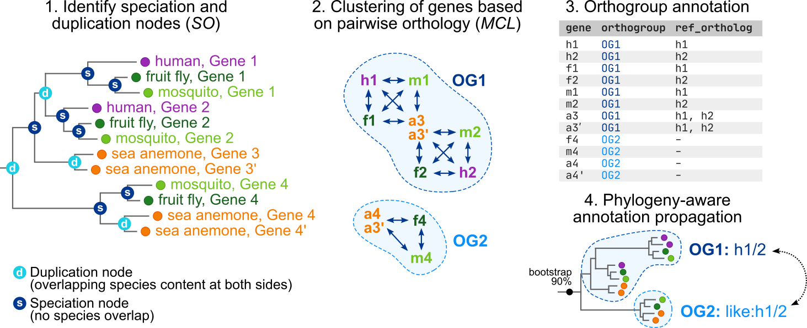
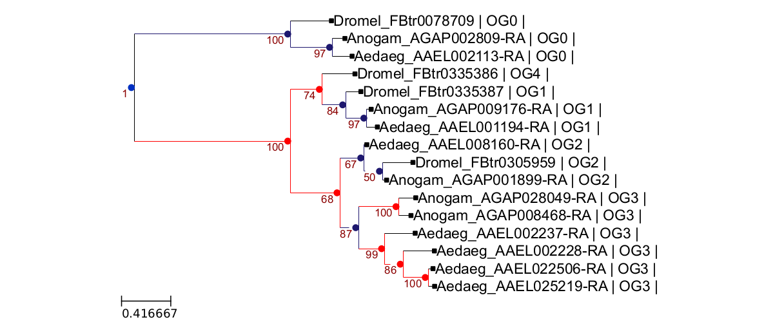
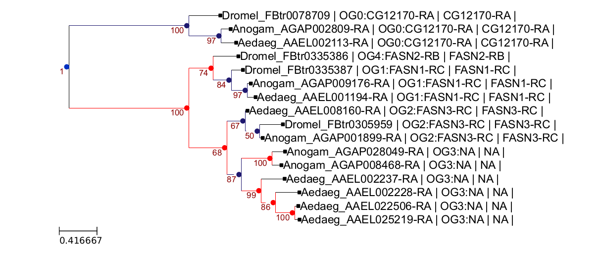

# Orthology inference with *Possvm*

***Possvm*** (_**P**hylogenetic **O**rtholog **S**orting with **S**pecies o**V**erlap and **M**CL_) is a python tool to analyse pre-computed gene trees and identify pairs and clusters of orthologous genes. It takes advantage of the **[species overlap algorithm](https://genomebiology.biomedcentral.com/articles/10.1186/gb-2007-8-6-r109)** implemented in the **[*ETE* toolkit](http://etetoolkit.org/docs/latest/tutorial/tutorial_phylogeny.html#species-overlap-so-algorithm)** to parse the phylogeny and identify orthologous gene pairs, and **[*MCL* clustering](https://micans.org/mcl/)** for orthogroup identification.



It **only requires a gene tree in newick format**, where the sequence name contains a prefix that indicates their species of origin, e.g. `human_gene1`. It does **not** require a species tree to infer orthologs.

## How it works

An overview of *Possvm* can be found here:

> Orthology clustering from gene trees with *Possvm* ([Grau-Bové and Sebé-Pedrós, MBE 2021](https://academic.oup.com/mbe/advance-article/doi/10.1093/molbev/msab234/6342420))



*Possvm* works in four basic steps:

1. Identification of orthology pairs using Species Overlap, which are used to build an orthology graph.
2. Obtain orthology clusters from pairwise orthology relationships, using MCL clustering.
3. Produce parseable tables with orthogroups and ortholog pairs.
4. Orthogroups can be annotated using names from reference member genes, in a phylogeny-aware manner.

## Manual

All functions are available in the **`possvm.py`** script.

### Input and output

Input:

1. Gene trees in **NEWICK format**, which may contain node supports (node supports are only necessary for some extra functionalities).
2. Optionally, a list of reference genes with names can be supplied (`-r` flag). *Possvm* will use it to label the orthgroups with user-supplied names. This is a simple tab-separated table where the first column is the gene id (same as used in the gene tree file) and the second column is the gene name:

```bash
human_gene1   gene_name_A
human_gene2   gene_name_A
human_gene3   gene_name_B

# Note that this file can be redundant, i.e. you can use 
# the same name for more than one gene id (useful to reduce 
# paralog/isoform redundancy). 
# Example in `test/drosophila_gene_names.csv`
```

Output:

1. Per-gene orthogroup classification (filename: `ortholog_groups.csv`). A CSV table with all genes and their annotations, in the following format:

```bash
gene        orthogroup   orthogroup_support   reference_ortholog  reference_support
spA_gene1   OG0          100.0                spA_gene1           100.0
spB_gene2   OG0          100.0                spA_gene1           90.0
spC_gene3   OG0          100.0                spA_gene1           100.0
spB_gene4   OG1          75.0                 NA                  NA
spC_gene5   OG1          75.0                 NA                  NA
```
  
> * `gene` is the gene id
> * `orthogroup` is the orthogroup id produced by *Possvm*
> * `orthogroup_support` is the statistical support at the deepest node of each orthogroup (if available, `NA` otherwise)
> * `reference_ortholog`: direct orthologs of each gene in the list of reference gene names (`NA` if no list supplied)
> * `reference_support`: statistical support at the deepest node separating each gene and their orthologs in the list of reference gene names (`NA` if no list supplied/no supports available).

2. Annotated phylogeny in Newick and PDF format (filenames: `ortholog_groups.newick` and `ortholog_groups.newick.pdf`; the `-skipprint` flag omits PDF production)

3. Pairs of orthologous genes and statistical support for their relationship, if available (filename: `ortholog_pairs.csv`). It is also possible to report all pairwise relationships between genes (orthologs and paralogs) using the `-printallpairs` flag (filename: `pairs_all.csv`)

### Usage

Available options:

```man
usage: possvm.py [-h] -i IN [-o OUT] [-p PHY] [-r REF] [-refsps REFSPS]
                 [-s SOS] [-method METHOD] [-inflation INFLATION]
                 [-outgroup OUTGROUP] [-split SPLIT]
                 [-itermidroot ITERMIDROOT] [-skiproot] [-skipprint]
                 [-printallpairs] [-min_support_node MIN_SUPPORT_NODE]
                 [-min_support_transfer MIN_SUPPORT_TRANSFER]
                 [-clean_gene_names] [-cut_gene_names CUT_GENE_NAMES]
                 [-ogprefix OGPREFIX] [-spstree SPSTREE] [-v]

optional arguments:
  -h, --help            show this help message and exit
  -i IN, --in IN        Path to a phylogenetic tree in newick format. Each
                        sequence in the tree must have a prefix indicating the
                        species, separated from gene name with a split
                        character. Default split character is "_", see --split
                        for options.
  -o OUT, --out OUT     OPTIONAL: String. Path to output folder. Defaults to
                        same directory as input file.
  -p PHY, --phy PHY     OPTIONAL: String. Prefix for output files. Defaults to
                        `basename` of input phylogeny. Default behaviour will
                        never overwrite original files, because it adds
                        suffixes.
  -r REF, --ref REF     OPTIONAL: String. Path to a table indicating reference
                        gene names that can be used for orthogroup labeling.
                        Format: geneid <tab> name.
  -refsps REFSPS, --refsps REFSPS
                        OPTIONAL: String. Comma-separated list of reference
                        species that will be used for orthogroup labeling. If
                        absent, all gene names present in the -r table will be
                        considered.
  -s SOS, --sos SOS     OPTIONAL: Float. Species overlap threshold used for
                        orthology inference in ETE. Default is 0. Higher
                        values (up to 1) result in more inclusive groupings.
  -method METHOD, --method METHOD
                        OPTIONAL: String. Clustering method. Options are `mcl`
                        (MCL, default), `mclw` (MCL weighted by node
                        supports), `louvain` (Louvain), or `lpa` (label
                        propagation algorithm).
  -inflation INFLATION, --inflation INFLATION
                        OPTIONAL: Float. Inflation hyperparameter for MCL
                        clustering. Only applicable if `method` is `mcl` or
                        `mclw`. In practice, the most inflation-responsive
                        method is `mclw`.
  -outgroup OUTGROUP, --outgroup OUTGROUP
                        OPTIONAL: String. Define a set of species that are
                        treated as outgroups in the phylogeny, and excluded
                        from orthology clustering. Can be a comma-separated
                        list of species, or a file with one species per line.
                        This option DOES NOT affect tree rooting, just
                        orthology clustering. Disabled by default.
  -split SPLIT, --split SPLIT
                        OPTIONAL: String to use as species prefix delimiter in
                        gene ids, e.g. "_" for gene names formatted as
                        speciesA_geneX. Defaults to "_".
  -itermidroot ITERMIDROOT, --itermidroot ITERMIDROOT
                        OPTIONAL: Integer. Turns on iterative midpoint rooting
                        with INT iterations, which is used instead of the
                        default midpoint rooting. Low numbers are recommended
                        (e.g. 10 is often more than enough).
  -skiproot, --skiproot
                        OPTIONAL: Bool. Turns off tree rooting, in case your
                        trees are already rooted.
  -skipprint, --skipprint
                        OPTIONAL: Bool. Turns off printing of annotated
                        phylogeny in PDF format (annotated newick is still
                        produced).
  -printallpairs, --printallpairs
                        OPTIONAL: Bool. Turns on the production of a table
                        with pairwise orthology/paralogy relationships between
                        all pairs of genes in the phylogeny (default behaviour
                        is to only report pairs of orthologs).
  -min_support_node MIN_SUPPORT_NODE, --min_support_node MIN_SUPPORT_NODE
                        OPTIONAL: Float. Min node support to consider
                        orthology relationships. If not set, all relationships
                        are considered.
  -min_support_transfer MIN_SUPPORT_TRANSFER, --min_support_transfer MIN_SUPPORT_TRANSFER
                        OPTIONAL: Float. Min node support to allow transfer of
                        labels from labelled to non-labelled groups in the
                        same clade. If not set, this step is skipped.
  -clean_gene_names, --clean_gene_names
                        OPTIONAL: Bool. Will attempt to "clean" gene names
                        from the reference table (see -r) used to create
                        cluster names, to avoid very long strings in groups
                        with many paralogs. Currently, it collapses number
                        suffixes in gene names, and converts strings such as
                        Hox2/Hox4 to Hox2-4. More complex substitutions are
                        not supported.
  -cut_gene_names CUT_GENE_NAMES, --cut_gene_names CUT_GENE_NAMES
                        OPTIONAL: Integer. If set, will shorten cluster name
                        strings to the given length in the PDF file, to avoid
                        long strings in groups with many paralogs. Default is
                        no shortening.
  -ogprefix OGPREFIX, --ogprefix OGPREFIX
                        OPTIONAL: String. Prefix for ortholog clusters.
                        Defaults to "OG".
  -spstree SPSTREE, --spstree SPSTREE
                        OPTIONAL: Path to a species tree. If this is provided,
                        Possvm will use a species tree reconciliation
                        algorithm instead of species overlap.
  -v, --version         show program's version number and exit

```

If you happen to have a species tree for your dataset, you can also use the script provided in `scripts/possvm_reconstruction.py` to **reconstruct ancestral gains and losses using Dollo parsimony**. This species tree is not required for `possvm`'s main functionality, it's just a convenience tool. In this case, your species tree should include all species present in your gene trees (it can include species absent in your gene tree too, e.g. where losses occur), and all the ancestral nodes should be labelled, as follows (newick format):

```bash
(Dromel,(Aedaeg,Anogam)mosquitoes)insects;
```

Please keep in mind that Dollo parsimony is not always the most appropriate evolutionary model for ancestral reconstruction as it does not account for the possibility of parallel gains, and it tends to inflate the number of presences in the ancestral node.

### Test

You can test *Possvm* using a small phylogeny of [fatty acid synthases from three insects](https://elifesciences.org/articles/58019) (*Drosophila melanogaster* and two mosquitoes, *Anopheles gambiae* and *Aedes aegypti*), which can be found in the `test/` folder.

1. Identify ortholog clusters in the gene tree (`OG0` to `OG4`):

```bash
possvm -i test/fa_synthases.newick -p fa_synthases_unnamed
# -i path to gene tree
# -p output filename
```



2. Same, but annotating the orthogroups with *Drosophila* gene names if possible, and reporting relationships between all gene pairs:

```bash
possvm -i test/fa_synthases.newick -r test/drosophila_gene_names.csv -p fa_synthases_named -printallpairs
```

3. If you have a fully labelled species tree, you can **reconstruct ancestral characters with Dollo parsimony**:

```bash
python scripts/possvm_reconstruction.py -ort test/fa_synthases_unnamed.ortholog_groups.csv -tree test/species_tree.newick -out test/species_tree.ancestral_reconstruction
```



### Installation

***Possvm*** depends on the [*ETE* toolkit](http://etetoolkit.org/) Python library, which currently works best with Python 3.6 or greater and can be installed via *conda*. We thus recommend that you use conda to install *ETE* and all other dependencies.

Once you have a working installation of *conda* (see [here for instructions](http://etetoolkit.org/download/)), you can run the following commands:

```bash
# create environment for possvm
conda create -n possvm
conda activate possvm
# install dependencies
conda install -c etetoolkit ete3
conda install -c bioconda pandas networkx markov_clustering matplotlib numpy
```

Alternatively, you can use the `environment.yaml` file bundled in this repository to reproduce the environment:

```bash
# create env and install packages
conda env create -n possvm --file environment.yaml
conda activate possvm
```

Both options should download and install all basic dependencies, including the following packages:

```bash
ete3                      3.1.2              pyh39e3cac_0    etetoolkit
markov_clustering         0.0.6                      py_0    bioconda
matplotlib                3.3.2                h06a4308_0  
matplotlib-base           3.3.2            py36h817c723_0  
networkx                  2.5                        py_0  
numpy                     1.19.2           py36h54aff64_0  
numpy-base                1.19.2           py36hfa32c7d_0  
pandas                    1.1.3            py36he6710b0_0  
python                    3.6.12               hcff3b4d_2  
```

Once these dependencies are up and running, you can run *Possvm* like any Python script:

```bash
python possvm.py -h

# maybe add it as an alias, because you're going to use it everyday?
echo "alias possvm=\"python $(pwd)/possvm.py\"" >> ~/.bashrc
source ~/.bashrc
possvm -h
```

## Benchmarking

As part of our manuscript ([Grau-Bové and Sebé-Pedrós, MBE 2021](https://academic.oup.com/mbe/advance-article/doi/10.1093/molbev/msab234/6342420)), we assessed *Possvm*'s accuracy against curated gene family classifications from the Orthobench and HomeoDB databases. You can find data and code to reproduce these analyses in [our companion repository](https://github.com/xgrau/possvm-orthology-benchmarking).

## How to cite

If you use *Possvm*, please cite the following papers:

* *Possvm* paper: **[Grau-Bové and Sebé-Pedrós, MBE 2021](https://academic.oup.com/mbe/advance-article/doi/10.1093/molbev/msab234/6342420)**.
* *ETE* toolkit: **[Huerta-Cepas *et al.* MBE 2016](https://academic.oup.com/mbe/article/33/6/1635/2579822)**.
* Species overlap algorithm: **[Huerta-Cepas *et al.* Genome Biology 2007](https://genomebiology.biomedcentral.com/articles/10.1186/gb-2007-8-6-r109)**.
* *MCL* clustering: **[Enright *et al.* NAR 2002](https://pubmed.ncbi.nlm.nih.gov/11917018/)**.
